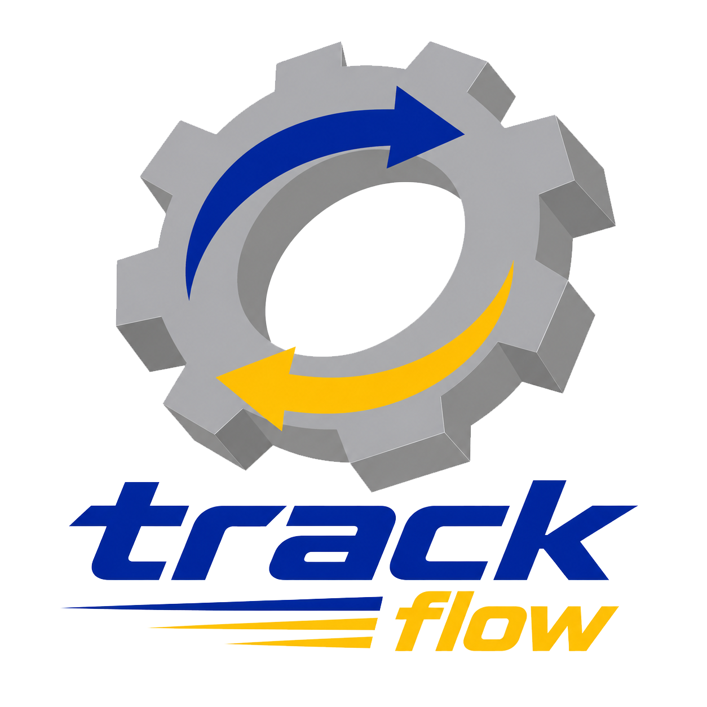

<h1>ㅤㅤㅤㅤㅤAPI 2º Semestre Logística - Noturno</h1>
<h1> 

      
      

      Equipe Trackflow </h1>

  <a href ="#status"> Status do Projeto</a>  |
  <a href ="#objetivo"> Objetivo</a>  |
  <a href ="#competencias"> Competências trabalhadas</a>  |    
  <a href ="#backlog"> Backlog</a>  |
  <a href ="#sprints"> Sprints</a>  |    
  <a href ="#equipe"> Equipe</a>  |
  <a href ="#tecnologias"> Tecnologias Usadas</a>  

<h2> 🔋 Status do Projeto:   </h2> </h2>

> Status do projeto: [Primeira Sprint - 🚩](https://github.com/Fatec-API-TF/2-LOG-API/blob/main/MVP/sp1.md)
>
> 
>
> Documentação: [Documentação do Projeto - 📖](https://github.com/Fatec-API-TF/2-LOG-API/tree/main/Docs)

<h2> 🏃‍♂️ Objetivo:  </h2>

O objetivo deste projeto é desenvolver uma plataforma no Power BI para analisar a sinistralidade de veículos pesados no Brasil. Integrando dados da PRF e do DataSUS, o painel monitora mortalidade, severidade e contexto demográfico/frota, além de mapear a distância entre os acidentes e os pontos de parada e descanso.

<h2> ✍️ Competências Trabalhadas:  </h2>
- Documentação de projeto ágil (backlog de produto, de sprint, briefing, etc.)  
- Processo de desenvolvimento ágil    
- Caracterização do produto logístico   
- Lógica de programação básica  
- Lógica matemática  
- Persistência de dados em BD relacional 

---

<h2> 🛠️ Backlog:  </h2></h2>

| Prioridade | Nº | User Story | Sprint |
| :---: | :--- | :--- | :--- |
| Alta 🔴 |  | Como equipe de projeto, quero criar o repositório no GitHub com a estrutura de pastas do projeto, para termos controle de versão dos artefatos desde o início. | Sprint 1 |
| Alta 🔴 |  | Como equipe de projeto, quero documentar o backlog do produto e do sprint, para termos o planejamento ágil formalizado conforme exigido pelo curso. | Sprint 1 |
| Alta 🔴 |  | Como analista de dados, quero mapear e acessar as bases públicas necessárias (DATASUS – mortalidade, PRF – sinistros, frota de veículos, população — IBGE), para ter as fontes de dados do projeto identificadas. | Sprint 1 |
| Alta 🔴 |  | Como analista de dados, quero normalizar e limpar as bases de dados no Google Colab, para garantir dados consistentes e confiáveis para a análise. | Sprint 1 |
| Média 🟡 |  | Como analista de dados, quero realizar uma análise exploratória inicial dos dados, para identificar padrões, outliers e priorizar os indicadores a serem desenvolvidos. | Sprint 1 |
| Média 🟡 |  | Como equipe de projeto, quero consolidar as bases de dados de sinistros (PRF) e frota em um único dataset por estado/ano, para viabilizar o cálculo dos indicadores nos próximos sprints. | Sprint 1 |
| Média 🟡 |  | Como equipe, quero versionar os scripts Python e notebooks no GitHub a cada incremento, para manter rastreabilidade e permitir trabalho colaborativo. | Sprint 2 |
| Alta 🔴 |  | Como usuário do dashboard, quero visualizar a taxa de mortalidade por 100 mil habitantes por estado, para comparar a severidade dos sinistros entre os estados. | Sprint 2 |
| Alta 🔴 |  | Como usuário do dashboard, quero visualizar o indicador de sinistros por 10 mil veículos, para entender a frequência relativa de sinistros com veículos pesados por estado. | Sprint 2 |
| Média 🟡 |  | Como usuário do dashboard, quero comparar cada estado com a média nacional nos principais indicadores, para identificar rapidamente estados acima ou abaixo da média. | Sprint 2 |
| Média 🟡 |  | Como analista, quero calcular a correlação entre o crescimento da frota de veículos pesados e o aumento de sinistros fatais, para responder a essa questão de análise proposta pelo cliente. | Sprint 2 |
| Média 🟡 |  | Como analista, quero identificar quais estados têm maior taxa de letalidade envolvendo veículos pesados, para responder a essa questão de análise proposta pelo cliente. | Sprint 2 |
| Média 🟡 |  | Como analista, quero mapear os pontos de parada de descanso e calcular a distância entre eles e os locais de sinistros com veículos pesados, para apoiar a análise de infraestrutura viária. | Sprint 2 |
| Alta 🔴 |  | Como cliente (ONSV), quero participar de uma reunião de apresentação da Entrega 2, para validar o progresso dos indicadores e direcionar ajustes antes do dashboard final. | Sprint 2 |
| Alta 🔴 |  | Como usuário do dashboard, quero navegar por um mapa do Brasil com dados agregados por estado, para visualizar geograficamente os indicadores de segurança viária. | Sprint 3 |
| Alta 🔴 |  | Como usuário do dashboard, quero visualizar gráficos de tendência dos indicadores entre 2015 e 2025 por estado, para entender a evolução histórica da segurança viária. | Sprint 3 |
| Média 🟡 |  | Como usuário do dashboard, quero acessar qualquer informação relevante em poucos cliques, para ter uma navegação intuitiva pela plataforma. | Sprint 3 |
| Média 🟡 |  | Como usuário do dashboard, quero acessá-lo de forma responsiva em diferentes dispositivos, para consultar os dados também fora do desktop. | Sprint 3 |
| Alta 🔴 |  | Como usuário do dashboard, quero aplicar filtros por tipo de veículo, região, ano e gravidade do sinistro, para segmentar a análise conforme meu interesse. | Sprint 3 |
| Alta 🔴 |  | Como usuário do dashboard, quero aplicar um filtro cruzado entre dados de saúde (DATASUS) e transporte (PRF), para relacionar mortalidade e sinistros de forma integrada. | Sprint 3 |
| Alta 🔴 |  | Como equipe de projeto, quero produzir a documentação técnica completa do projeto (scripts de limpeza e modelagem em Python), para permitir a reprodutibilidade da solução. | Sprint 3 |
| Alta 🔴 |  | Como cliente (ONSV), quero receber um relatório técnico de análise com boas práticas e desafios por estado, para apoiar a formulação de políticas públicas ou estudos acadêmicos. | Sprint 3 |
| Alta 🔴 |  | Como equipe de projeto, quero gravar e publicar um vídeo no YouTube apresentando a solução final, para cumprir a forma de entrega definida para a Entrega 3 (26/nov). | Sprint 3 |
| Média 🟡 |  | Como equipe de projeto, quero apresentar o projeto presencialmente na Feira de Soluções da FATEC, para expor o resultado final do trabalho para banca e visitantes. | Sprint 3 |

---
<h2> ⚙️ Sprints:  </h2></h2>

| Sprint | Data da entrega | Acesso |
| :---: | :--- | :--- |
Sprint 1 | 30/09 | [Link para acesso](https://github.com/Fatec-API-TF/2-LOG-API/blob/main/MVP/sp1.md)
Sprint 2 | 28/10 | [Link para acesso]()
Sprint 3 | 25/11 | [Link para acesso]()

---

<h2> 🤝 Equipe:  </h2></h2>

  <table>
    <tr>
      <th>Membro</th>
      <th>Função</th>
      <th>Github</th>
      <th>Linkedin</th>
    </tr>
    <tr>
      <td>Rodrigo Azavedo</td>
      <td>Product Owner</td>
      <td></td>
      <td></td>
    </tr>
    <tr>
      <td>Kauan Assis</td>
      <td>Scrum Master</td>
      <td></td>
      <td></td>
    </tr>
    <tr>
      <td>Gustavo Funari</td>
      <td>Team Member</td>
      <td></td>
      <td></td>
    </tr>
    <tr>
      <td>Leonardo Balieiro</td>
      <td>Team Member</td>
      <td></td>
      <td></td>
    </tr>
    <tr>
      <td>Nikolas Maura</td>
      <td>Team Member</td>
      <td></td>
      <td></td>
    </tr>
    <tr>
      <td>Victor Oliveira</td>
      <td>Team Member</td>
      <td></td>
      <td></td>
    </tr>
    <tr>
      <td>Willian Ortiz</td>
      <td>Team Member</td>
      <td></td>
      <td></td>
    </tr>
  </table>

---

<h2> 🤖 Tecnologias Usadas:   </h2> </h2>

<h4 align="center">
 
 
 
 
 
</h4>

